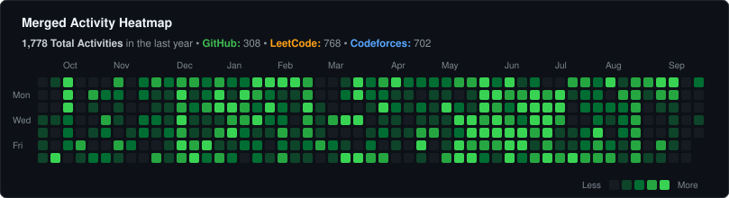

  
   

  
  
  
  

   
  📫 How to reach me: **akkisinghvi28@gmail.com**

---

### 📊 Merged Activity Heatmap

  

---

### 🏆 Competitive Programming

  
  

---

### 🛠️ Languages & Technologies

  
  
  
  
  
  
  

 

- **Languages & Scripting:** Python, Bash / Shell, SQL
- **Databases & In-Memory:** PostgreSQL, MySQL, Redis, SQLite
- **Backend & APIs:** FastAPI, Django, Flask, REST APIs
- **Tools & Systems:** Linux / Unix, Git, Docker, Postman

---

🧠 Passionate about **problem solving**, **competitive programming**, and **building scalable software systems**.  
💻 Regularly exploring advanced algorithms, data structures, and backend systems.  
🚀 Always curious, always learning and building.  
💬 Open to collaboration and conversations around algorithms, system design, and impactful projects!
